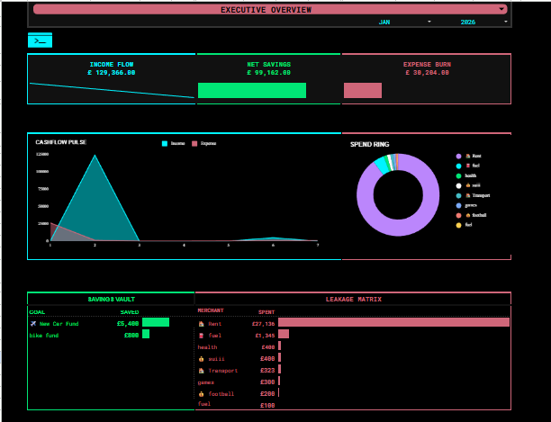
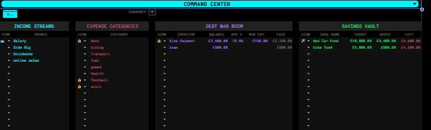
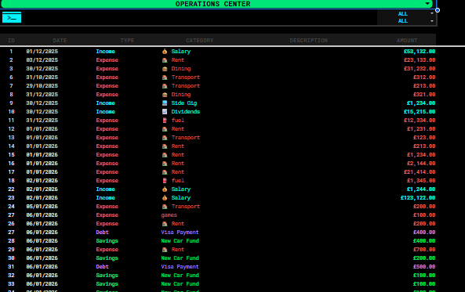

# 💎 Cyber-Finance Gold: Strategic Wealth Engine

*(The "Executive Overview" showing real-time liquidity, burn rate, and projected savings)*

---

### 📊 Project Overview
This project represents a **Product-First approach** to personal finance. 

Most budget spreadsheets are static and reactive. I designed "Cyber-Finance Gold" to be **dynamic and predictive**. It functions as a complete "Financial Operating System" that forces the user to actively manage Liquidity, Burn Rate, and Net Asset Value (NAV) in real-time. 

**Goal:** To engineer a logic-based system that eliminates calculation errors and provides institutional-grade financial visibility for personal use.

---

### 🛠️ Skills & Logic Used
* **Platform:** Advanced Google Sheets / Excel
* **Data Modeling:** Relational table structure (linking Transactions to Asset IDs).
* **Advanced Logic:** Complex Nested Formulas (`SUMIFS`, `GETPIVOTDATA`, `XLOOKUP`, `ARRAYFORMULA`).
* **UI/UX Design:** Conditional Formatting for visual status indicators and "App-like" dashboard layout.
* **Error Proofing:** Strict Data Validation rules to ensure database integrity.

---

### 🚀 Key Modules

#### 1. The "Command Center" (Asset Registry)

* **Function:** The central database for all financial entities (Income Streams, Debts, Savings Goals).
* **Logic:** This sheet feeds the dropdown menus in the rest of the tracker. It allows for "Object-Oriented" tracking—if you change a Debt Account name here, it updates the entire history automatically.

#### 2. The "Operations Center" (Transaction Database)

* **Function:** A strict, validated ledger for every financial movement.
* **Feature:** Uses `XLOOKUP` and Array Formulas to auto-tag transactions with icons and categories, reducing manual entry time by 40%.

#### 3. The "Debt War Room" (Simulation Engine)
* **Function:** A forecasting tool built into the dashboard.
* **Logic:** Users input their Debt Balance and APR. The model calculates the "Daily Interest Cost" and projects the exact payoff date based on current repayment velocity.

---

### ⚙️ Methodology (System Architecture)
1.  **Input/Output Separation:** I architected the sheet to separate "Data Entry" (Operations Center) from "Data Visualization" (Executive Overview). This prevents formula breakage during daily use.
2.  **Dynamic Visualization:** Created a "Velocity Strip" visual using `SPARKLINE` formulas to show spending density over the month (visualizing *when* money leaves the account, not just *how much*).
3.  **Leakage Analysis:** Designed a logic block that aggregates "Small Frequent Expenses" (like coffee or subscriptions) to identify "Budget Leakage"—a critical metric for financial health.

---
*Created by **Calvin Immanuel D** | [Portfolio](https://nivlac8.github.io/)*
